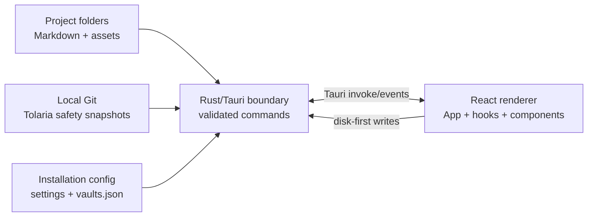
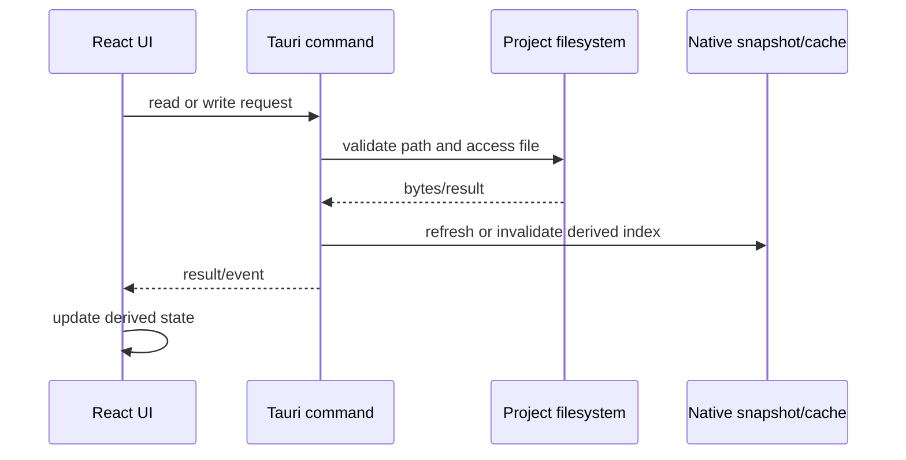

# Tolaria Architecture

This document describes the implementation that is currently in this fork after M0–M8. It is intentionally narrower than the historical upstream architecture. The repository is a Tauri desktop application with a React/TypeScript renderer and a Rust native boundary.

## Product boundary

Tolaria is a local Markdown notebook. A Project is a registered folder containing Markdown notes and related files. The files on disk remain the source of truth; Tolaria provides navigation, editing, indexing, local recovery, and presentation around those files.

The maintained surface is:

- folders, notes, tabs, backlinks, wikilinks, and keyboard navigation;
- rich Markdown editing plus a raw Markdown/text mode;
- tags stored in a lossless `tags` frontmatter array;
- an optional graph containing multiple registered Projects;
- local, invisible Git safety snapshots and deleted-note recovery;
- PDF, image, audio, video, and unsupported-file handling;
- durable tldraw whiteboards embedded in notes;
- persistent appearance, language, content, and Project settings.

The following product areas are no longer entry points in the active UI:

- AI panels, CLI-agent integrations, MCP, and generated agent guidance;
- types as a navigation system, custom properties UI, saved views, Inbox, Archive, Favorites, and note icons;
- visible Git history, diff, remote, sync, provider OAuth, and conflict workflows;
- standalone note windows, the legacy Workspace management surface, and deep links;
- telemetry, feedback collection, and the Getting Started vault clone flow;
- Sheet editing and in-app standalone HTML preview.

The simplification fork intentionally retains a few compatibility layers from the larger application. In particular, the source still contains `Workspace` names for Project graph helpers, 21 locale catalogs remain available, platform compatibility code remains in the native crate, and tldraw whiteboards remain supported. Those are current implementation facts, not invitations to remove them in an unrelated change. The deviation from the original P4 target is recorded in [ADR-0175](adr/0175-simplification-fork-ledger.md).

## Runtime composition



### Native shell and command boundary

`src-tauri/src/lib.rs` constructs the Tauri application, registers the command handler, installs the menu, and starts the native lifecycle. The command modules are grouped by responsibility:

| Domain | Representative modules | Responsibility |
|---|---|---|
| Vault and files | `commands/vault/*`, `vault/*` | Scan Projects, read/write notes, rename and move files, folders, attachments, reloads |
| Frontmatter | `commands/vault/frontmatter_cmds.rs`, `vault/frontmatter.rs` | Parse metadata and perform narrow metadata updates |
| Search | `search.rs`, `commands/vault/scan_cmds.rs` | Recursive Markdown full-text search with visibility filters |
| Git safety | `git/*`, `commands/git.rs` | Resolve repository scope, make local snapshots, expose recovery data |
| Project registry | `vault_list.rs`, `commands/vault_list.rs` | Persist registered Project paths and identities |
| Settings | `settings.rs`, `commands/settings.rs` | Read and normalize installation-local preferences |
| Runtime shell | `commands/runtime.rs`, `menu.rs`, update/icon modules | Menu routing, update shell, window/runtime integration |

The renderer never receives an unrestricted filesystem capability. Path-bearing commands validate the target against the active or registered Project root before reading or writing. Commands return serializable data; React owns presentation and session state.

## Renderer structure

`src/App.tsx` is the composition root. It coordinates the active Project graph, settings, dialogs, tabs, note selection, persistence, search, keyboard commands, and native event subscriptions. Feature logic is kept in hooks and utility modules so the main component mostly wires state owners together.

The main visual regions are:

1. **Sidebar** — Tags, folder navigation, and Project switching/configuration affordances. Tags are collapsed by default and are session-filter controls, not folder nodes. There is no dedicated All Notes sidebar item.
2. **Note list** — The visible entries for the selected folder/Project graph, plus tag-filter state and full-text search results.
3. **Editor** — Rich BlockNote editing, raw text editing, note metadata actions, tabs, and file previews.
4. **Status and overlays** — Settings, command palette, Quick Open, recovery, update shell, and transient messages.

Important owners include:

- `useVaultSwitcher` and `vaultListStore.ts` for registered Project selection and persistence;
- `useWorkspaceGraphState` for the multi-Project graph and writable Project paths;
- `useVaultLoader` for snapshot-first loading and reconciliation;
- `useVaultWatcher` for external filesystem changes;
- `useTabManagement` for tab identity, raw content hints, and active-note restoration;
- `useAppSave`, `useEditorSave`, and `useNoteCreation` for disk-first writes and autosave;
- `useCommandRegistry` and the command-domain modules for keyboard/menu actions;
- `SidebarTagsSection`, `NoteTagsRow`, and `utils/noteTags.ts` for tag indexing, editing, and filtering.

## Data ownership and persistence

### Three layers, one authority

Tolaria has three representations of a Project:

1. **Filesystem** — Markdown and asset files, which are authoritative and portable.
2. **Native cache/snapshot** — A disposable index used to make startup and reload fast.
3. **React state** — The current session graph, tabs, selection, and derived UI state.

The cache and renderer state must be reconstructible from the filesystem. If they disagree, a reload or watcher reconciliation replaces derived state with disk state.



### Write invariants

- A note save writes to disk before the confirmed state is treated as clean.
- A failed write does not become durable renderer state; optimistic flows have an error/reload path.
- Frontmatter writes are narrow. Tags may update only the `tags` key; unrelated keys and formatting are preserved by the existing frontmatter path.
- Renames and folder moves use validated paths and transactional recovery helpers.
- External changes are reconciled by watcher events. A clean active note may be refreshed; unsaved content is preserved according to the editor save contract.
- Derived caches are disposable and may be rebuilt without changing the Project files.

### Installation-local state

The native settings store persists installation preferences such as language, theme, date display, note width, ignored-file visibility, media visibility, automatic H1 rename, and the multi-Project switch. The vault registry persists Project paths and their display identity:

```text
Project identity = path + label + shortLabel + alias + color + icon + mounted
registry state   = ordered Projects + active Project + default new-note Project
```

These records are compatibility serialized with historical `vault` and `workspace` names. The UI presents the user-facing concept as **Project**.

## Project graph

The registry is loaded before selecting the startup Project. Each registered path is checked for availability, then `useWorkspaceGraphState` derives:

- the default Project used for startup and new-note writes;
- the set of mounted/visible Project roots;
- the writable root set used by note creation and save resolution;
- Project identity metadata attached to entries;
- the single-Project fallback when `multi_workspace_enabled` is false.

For backward compatibility, an absent `multi_workspace_enabled` value is treated as enabled. Disabling it shows the selected/default Project while preserving the registry. Project names, colors, order, mount state, aliases, and default destination survive restart through `vaults.json` and settings.

The graph is not a database. Entries from multiple roots are still file-backed, and an absolute note path is resolved to the deepest registered root that contains it before a native read or write.

## Note model and frontmatter

The renderer-facing `VaultEntry` contains the filename, title, path, timestamps, size, snippet, links, file kind, Project identity, and compatibility metadata. Most frontmatter is parsed for indexing or compatibility but is not exposed as an editing system.

The simplified user-managed metadata path is:

```yaml
tags:
  - project-notes
  - review-2026
```

Tag rules are enforced in `utils/noteTags.ts`: lowercase storage, ASCII letters/digits/hyphens only, no underscores or other punctuation, and a 15-character maximum. The header displays fixed-width chips with hover text; the sidebar counts tags across visible entries and applies an AND filter. Tag selection is session-only.

Existing frontmatter remains opaque to the rich editor and is preserved when the note body is rewritten. This is the portability boundary: Tolaria can read older files without requiring a migration, while the simplified UI avoids silently deleting metadata it does not own.

## Search and navigation

The three search/navigation paths have intentionally different scopes:

| Entry point | Scope | Matching behavior |
|---|---|---|
| `Cmd+K` | Command palette | Commands and actions, not note content |
| `Cmd+O` / Quick Open | Current visible Project graph | Case-insensitive fuzzy/prefix note-title/path matching; results are bounded to 20 |
| `Cmd+Shift+F` | Full text across all visible mounted Project roots | Recursive Markdown search, case-insensitive token-AND matching across filename/title/content, snippets, bounded result list (200 by default) with a truncation total |

Gitignored visibility is applied at the native command boundary. The full-text implementation does not impose an application-level maximum query length; practical limits are the operating system, Rust string allocation, and available memory. Search results are derived data and do not change folder selection or tag state.

## Editor and file handling

The editor supports a rich BlockNote path and a raw CodeMirror/text path. Markdown serialization remains durable and includes the retained editor features:

- headings, lists, links, wikilinks, code blocks, tables, math, Mermaid, callouts, and images;
- raw Markdown/text editing for unsupported or explicitly raw content;
- local attachment import and safe remote-image import;
- tabs with content identity checks before reusing a warm cache;
- PDF and common media previews when the platform supports them;
- unsupported-file messaging and external-open fallback.

Whiteboards are a deliberate compatibility exception to the original P4 plan. `TldrawWhiteboard.tsx` persists a durable representation inside the note and restores it when the note is reopened. The renderer contains WebKit-specific guards because this path is sensitive to native webview behavior.

Standalone HTML files are not rendered as an in-app HTML application preview. Existing legacy sheet/HTML metadata is parsed defensively so opening an old file does not crash the editor; unsupported content falls back to raw text or the unsupported-file surface.

## Invisible Git safety boundary

Git is a local safety mechanism rather than a collaboration UI. The app may create a local repository and make automatic snapshots so a deleted or overwritten note can be recovered, but the active product does not expose commit history, diff, remote, push, pull, or provider OAuth workflows.

Repository scope is deliberately constrained:

| Project location | Tolaria behavior |
|---|---|
| Plain folder | Tolaria may create a local managed repository for safety snapshots |
| Repository root with the Tolaria marker | Managed local snapshots are allowed |
| Existing repository root without the marker | Git data is read conservatively; the app does not silently take ownership |
| Project nested in an ancestor repository | The ancestor repository remains read-only from Tolaria; sibling files are outside the Project boundary |
| Non-Git or unavailable Git | File editing still works; Git dates/cache/recovery fall back or become unavailable |

Managed snapshots use a fixed local identity, path-limited operations, and no network side effects. The marker and workspace resolver survive restart. Deleted Markdown recovery is exposed as the `Restore Deleted Note…` command and only lists content that exists in a Tolaria-managed local snapshot; it is not a general undelete facility for every external repository or arbitrary binary file.

## Settings and localization

The settings panel currently persists four sections:

1. Projects (registry, identity, order, mounted/default state, and multi-Project display);
2. Sync & Updates (automatic update checks and release channel compatibility);
3. Appearance (theme and related display preferences);
4. Content (language, dates, note width, H1 rename, ignored files, and file-category visibility);

Telemetry is not rendered as a settings section and no telemetry implementation is used by the simplified product. Historical telemetry fields and ADRs remain only as compatibility/audit material.

The current renderer has 21 locale catalogs in `src/lib/locales/`, with English fallback and persisted `ui_language` selection. The historical target-state document proposed three catalogs; that reduction was not completed and must not be assumed by future changes. New UI strings still belong in the locale catalogs and must pass `pnpm l10n:validate`.

## Testing and operational boundaries

The test layers are:

- Vitest component, hook, and utility tests for renderer behavior;
- Rust unit/integration tests for path validation, frontmatter, Git scope, search, cache, and commands;
- Playwright smoke tests for browser-mode core flows such as opening Projects, creating/saving/deleting notes, search, wikilinks, and tag filtering;
- native macOS QA for Tauri-specific menus, filesystem access, settings persistence, and webview-sensitive whiteboards.

The final M8 validation commands are listed in [the phase plan](refactor/03-phase-plan.md). Release-workflow assertions are retained and run when the fork contains the corresponding workflow fixtures; this checkout has no release pipeline, so those two assertions are explicitly skipped rather than replaced with fabricated workflows.

## Change guidance

When extending the app:

1. Check the active ADRs and this document before introducing a new product surface.
2. Keep files authoritative and use the existing Tauri path-validation helpers.
3. Reuse existing hooks/components and keep user-facing copy localized.
4. Add a focused regression test for behavior changes and a smoke test for core note flows.
5. Update this document and `ABSTRACTIONS.md` when a command, data boundary, or persistent model changes.
6. Treat the simplification-fork ADR as a scope boundary; do not reintroduce retired systems by restoring old entry points accidentally.
