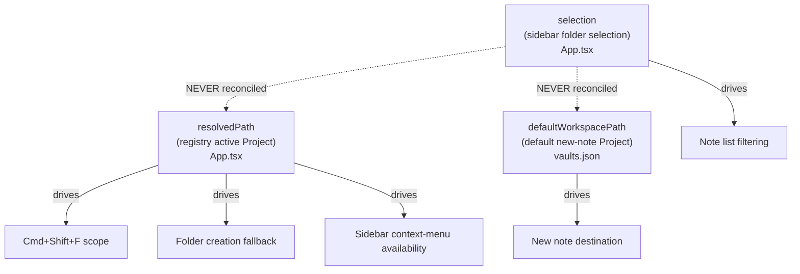
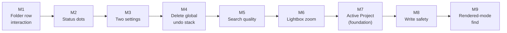

# 06 — UX Remediation Plan

Sequenced remediation plan for thirteen defects and gaps reported from hands-on use of the
Tolaria desktop app. The work is split into nine milestones ordered **strictly by
implementation difficulty, easiest first**. A coding agent is expected to execute one
milestone at a time, top to bottom, and to stop at each milestone boundary for review.

This document is the complete handoff. It assumes no access to the conversation in which
these decisions were made.

---

## 1. Context and handoff

### 1.1 What this repository is

Tolaria is a local Markdown notebook built as a Tauri desktop application: a React +
TypeScript renderer over a Rust native boundary. Files on disk are the source of truth. See
[`docs/ARCHITECTURE.md`](../ARCHITECTURE.md) and [`docs/ABSTRACTIONS.md`](../ABSTRACTIONS.md)
before starting, and read [`AGENTS.md`](../../AGENTS.md) for the working agreement that governs
every commit.

The layout that matters for this plan:

| Area | Where |
|---|---|
| Composition root | `src/App.tsx` |
| Sidebar folder tree | `src/components/FolderTree.tsx`, `src/components/folder-tree/*` |
| Note list | `src/components/NoteList.tsx`, `src/components/NoteItem.tsx`, `src/components/note-list/*` |
| Editor | `src/components/Editor.tsx`, `src/components/SingleEditorView.tsx`, `src/components/RawEditorView.tsx` |
| Save / tab lifecycle | `src/hooks/useEditorSave.ts`, `src/hooks/useEditorTabSwap.ts`, `src/hooks/editorChangeDebounce.ts` |
| Project registry / graph | `src/hooks/useVaultSwitcher.ts`, `src/hooks/useWorkspaceGraphState.ts`, `src/lib/vaultListStore.ts` |
| Native command boundary | `src-tauri/src/commands/*`, `src-tauri/src/lib.rs` |
| Full-text search | `src-tauri/src/search.rs`, `src-tauri/src/commands/vault/scan_cmds.rs` |
| Settings persistence | `src-tauri/src/settings.rs`, `src/types.ts` (`Settings`), `src/components/SettingsPanel.tsx` |
| Localization | `src/lib/locales/*.json` (21 catalogs), `lara.yaml` |

### 1.2 Where the reported problems come from

Nine of the thirteen reports are independent, local defects. **Four of them are one root
cause**: the application has three competing notions of "the current Project", and they are
never reconciled.



Selecting a folder in the sidebar changes what the note list shows and nothing else. New
notes, full-text search, folder creation, and sidebar context-menu availability all keep
pointing at the registry's active or default Project. Milestone **M7** collapses the three
concepts into one and unblocks reports #1, #10, #12a, and #13 together.

### 1.3 How to execute this plan

1. Work **one milestone at a time**, in the listed order. Do not start M(n+1) before M(n)
   meets its Definition of Done.
2. Follow the repository TDD loop from `AGENTS.md`: write the listed red test first, make it
   pass with the smallest change, refactor, then run the verification commands.
3. Line numbers in this document are anchors captured against the working tree at the time of
   writing. They **will drift**. Every reference also names the symbol; re-locate by symbol
   name (`rg -n '<symbol>' src/`) rather than trusting the number.
4. Keep user-facing copy in `src/lib/locales/en.json` and run the localization pipeline
   whenever copy changes.
5. Do not create commits or Git history unless the repository owner explicitly asks.

### 1.4 Baseline verification commands

Every milestone runs at least these:

```bash
pnpm lint
pnpm exec tsc --noEmit
pnpm test
cargo test --manifest-path src-tauri/Cargo.toml
```

Additional commands are listed per milestone. Do not claim a gate passed without reading its
output.

---

## 2. Domain vocabulary

These terms were agreed during planning. Use them in code, tests, comments, and commit
messages. Where the codebase uses a legacy name, the legacy name is noted — do not rename
serialized fields as part of this plan.

| Term | Definition | Legacy names in code |
|---|---|---|
| **Project** | A folder registered in `vaults.json`, containing Markdown notes and related files. The user-facing concept. | `vault`, `workspace` in serialized records and many identifiers |
| **Active Project** | **New concept introduced by M7.** The single authoritative Project that write and search operations target. Derived as `selection.rootPath ?? vaultSwitcher.vaultPath`. | none — must be created |
| **Active Folder** | The folder inside the Active Project that the note list is showing. `selection.path`; empty string means the Project root. | `selection.path` |
| **Default Project** | `defaultWorkspacePath` in the registry. After M7 this is **only** the fallback used when no folder selection resolves a Project. It no longer decides where new notes land. | `defaultWorkspacePath`, `default_workspace_path` |
| **Active Note** | The entry backing the currently focused tab. | `activeTab.entry` |
| **Note Status** | After M2, narrowed to `unsaved` \| `pendingSave` \| `clean`. Purely a transient save-progress signal. `new` and `modified` are retired. | `NoteStatus` in `src/types.ts` |
| **Mounted Project** | A registered Project currently included in the multi-Project note graph. | `mounted`, `visibleWorkspacePathList` |
| **Project root row** | The synthetic sidebar row representing a Project's root folder. Its `FolderNode.path` is the empty string. | ADR-0100 |

### Terms deliberately *not* introduced

- **"Workspace"** as a user-facing word. It survives only as a compatibility identifier
  (ADR-0175). Never surface it in UI copy.
- **"Vault"** as a user-facing word. Same rule.

---

## 3. Decision ledger

Each row records what was decided and, where a reasonable alternative was rejected, why.
A coding agent encountering a design fork should re-read this table before improvising.

| ID | Decision | Rejected alternative and why |
|---|---|---|
| **D1** | `Active Project := selection.rootPath ?? vaultSwitcher.vaultPath`. One concept drives new-note destination, search scope, folder creation, and sidebar mutation permissions. | *Keep the two concepts and label the target Project in the UI.* Rejected: it documents the confusion instead of removing it. *Only Project-root rows switch the active Project.* Rejected: users still have to know that a sub-folder click is "weaker" than a root click. |
| **D2** | Opening a note from anywhere (Quick Open, backlinks, search results, wikilinks) reveals it in the sidebar **and switches the Active Project** to its owner. VS Code semantics: "wherever you are looking is where you are working." | *Reveal visually without switching* — would require a fourth state (revealed-but-not-selected) and makes "where will my next note go?" unanswerable. *Make it an opt-in setting* — deferred; revisit only if the switching turns out to be disruptive in practice. |
| **D3** | Report #5 has no confirmed mechanism. It is folded into M8 as a reproduce-then-fix task, not a speculative patch. | *Guess at a fix now.* Rejected: a wrong guess on a data-loss path is worse than the current state. |
| **D4** | Delete the global `useActionHistory` stack outright. `Cmd+Z` / `Cmd+Shift+Z` act only on the currently open document. | *Shard the global stack per note path.* Rejected: keeps a second undo system alive for a single feature (frontmatter/tag edits) that users can trivially redo by hand. *Only remove the auto-jump.* Rejected: leaves the confusing global-stack concept in place. |
| **D5** | Status dots narrow to transient save state only. Git-derived `new`/`modified` **and** session-scoped `newPaths`-derived `new` are all removed. A dot appears while typing and disappears once the write lands. | *Remove all dots.* Rejected: with the M8 data-loss investigation still open, the user needs a visible save signal. *Keep git-derived dots.* Rejected: untracked files stay green forever, which is the reported symptom. |
| **D6** | The "show original filename" toggle affects **the note list only**. Quick Open, full-text search results, tabs, and breadcrumbs keep showing the derived title. | *Apply everywhere.* Explicitly considered and declined by the owner in favour of a smaller change. The resulting inconsistency is a **known, accepted** limitation — see §6. |
| **D7** | Sidebar folder rows: single click on an unselected folder selects only; single click on an already-selected folder toggles expansion immediately; double-click-to-rename is removed; rename lives only in the right-click menu. The 180 ms disambiguation delay is deleted. | *Add a disclosure chevron.* Not needed once double-click stops competing for the first click. |
| **D8** | Project root rows keep **no** disk-level rename or delete. Renaming a Project's root directory would have to re-point `vaults.json`, every open tab, the Git repository, and the cache. Recorded as a deferred candidate, not in scope. | *Add "Rename project" to the root row context menu* (label-only rename). Declined to avoid a second rename entry point with different semantics from the sibling "Rename folder" item. |
| **D9** | Search matching model for the in-note find bar (`Cmd+F`): match **rendered, visible text** in the rich editor. Do not force a switch to raw mode. When the query matches nothing visible, hint that syntax characters are searchable in raw mode. | *Match the Markdown source and highlight the containing block.* Rejected: block-granularity highlighting cannot tell the user which characters matched, and it requires maintaining a source-offset ↔ block map. |
| **D10** | Lightbox opens on **double-click** for both images and Mermaid diagrams. The Mermaid expand button is kept as a discovery affordance. Zoom, pan, fit/1:1, and Escape live inside the lightbox. | *Single click to open.* Rejected: single click on an image is BlockNote's "select the image block" gesture, which backs drag, resize, and caption editing. |
| **D11** | Full-text search fixes: raise the result cap from 20 to 200 **and surface truncation**; add the filename to the match candidate set; split the query on whitespace and require **all** tokens to match (AND). | *Only raise the cap.* Rejected: it leaves two of the four reported "cannot find it" causes in place. |
| **D12** | The "show non-Markdown files in folders" toggle is **new and separate**. The three existing `all_notes_show_pdfs` / `_images` / `_unsupported` settings keep their current scope (the All Notes view) and are not migrated. | *Merge all four into one global toggle.* Declined by the owner to avoid a settings migration. Accepted cost: a `.png` can be hidden in All Notes yet visible in its folder. |
| **D13** | Report #7 gets **both** a root-cause investigation *and* defensive hardening: blocking flush-before-swap plus a shorter debounce chain. | *Investigate only* — leaves a 3-second data-loss window open for the duration of the plan. *Harden only* — risks masking a non-timing root cause and making it harder to find later. |
| **D14** | Milestones are ordered strictly by implementation difficulty. This places the only true data-loss item (M8) second from last. The owner reviewed and accepted this ordering. | *Promote the data-loss fix to M1* — rejected because the first milestone would then be the hardest and most timing-sensitive one, a common place for execution to stall. *Split a small "stop the bleeding" slice into M1* — offered and declined in favour of one cohesive milestone. |

---

## 4. Milestone sequence



| Milestone | Reports | Difficulty | Blocking relationship |
|---|---|---|---|
| M1 | #6 | Trivial | none |
| M2 | #2 | Small | none |
| M3 | #3, #11 | Small | none |
| M4 | #4 | Small–medium | none |
| M5 | #12b, #12c, #12d | Medium | independent of #12a |
| M6 | #8 | Medium | none |
| M7 | #1, #10, #12a, #13 | Large | **foundation**; nothing before it depends on it |
| M8 | #5, #7 | Large, high risk | none |
| M9 | #9 | Largest | none |

Difficulty order and dependency order do not conflict. M7 is the only shared foundation and
nothing scheduled before it depends on it.

---

## M1 — Sidebar folder row interaction

**Report #6.** Clicking a folder both selects it and toggles its expansion, so selecting a
different folder collapses it as a side effect.

### Current behaviour

`src/components/folder-tree/useFolderRowInteractions.ts`

- `FOLDER_ROW_SINGLE_CLICK_DELAY_MS = 180` (line 3).
- `handleSelectClick` (lines 29–44) calls `onSelect()` immediately, then schedules
  `onToggle()` behind a 180 ms timer.
- `handleRenameDoubleClick` (lines 46–49) cancels that timer and starts a rename.

`src/components/folder-tree/FolderItemRow.tsx`

- `onDoubleClick={handleRenameDoubleClick}` is bound on `FolderSelectButton` (line ~117).
- The row is a single `<Button>`. There is **no** disclosure chevron.

The 180 ms delay exists solely to disambiguate "single click, so toggle" from "first half of a
double click, so rename". Removing double-click rename removes the need for the delay.

Rename is already reachable elsewhere:

- `src/components/folder-tree/FolderContextMenu.tsx` line ~104 renders `Rename folder`,
  gated by `canMutateFolder = menu.path.length > 0` (line ~75).
- `src/hooks/folder-actions/useFolderRename.ts` `renameFolder` (line ~30) calls
  `invokeRenameFolder`, which **does** rename the real directory on disk.

Two pre-existing gaps are **out of scope** here (see D8 and M7):

- Project root rows (`node.path === ''`) have no rename or delete menu item.
- `src/components/folder-tree/FolderTreeRow.tsx` line ~324:
  `canUseDefaultFolderActions = !nodeRootPath || nodeRootPath === rootPath`. Folders belonging
  to a non-active Project have their entire context menu disabled. **M7 fixes this.**

### Target behaviour

| Gesture | Result |
|---|---|
| Single click on an **unselected** folder row | Select it. Expansion state unchanged. No delay. |
| Single click on an **already-selected** folder row | Toggle expand/collapse immediately. Selection unchanged. |
| Single click on a folder with no children | Select only; toggling is a no-op. |
| Double click on a folder row | Nothing. |
| Right-click → Rename folder | Unchanged (still renames the real directory, still unavailable on root rows). |

### Files to change

- `src/components/folder-tree/useFolderRowInteractions.ts` — remove
  `FOLDER_ROW_SINGLE_CLICK_DELAY_MS`, the pending-toggle ref, the timer, and
  `handleRenameDoubleClick`. `handleSelectClick` needs a new input: whether this row is
  currently selected.
- `src/components/folder-tree/FolderItemRow.tsx` — drop the `onDoubleClick` binding and the
  `onStartRenameFolder` prop plumbed for it; pass `isSelected` into the interaction hook.
- `src/components/folder-tree/FolderTreeRow.tsx` — stop threading
  `onStartRenameFolder` into `FolderItemRow` for the double-click path. The context-menu path
  must keep working.
- `src/components/FolderTree.test.tsx` — seven call sites use
  `vi.advanceTimersByTime(FOLDER_ROW_SINGLE_CLICK_DELAY_MS)` (lines ~5, 112, 118, 130, 170,
  178, 424, 465). All must be rewritten against the new synchronous behaviour.

### Red tests to write first

In `src/components/FolderTree.test.tsx` (or a focused
`src/components/folder-tree/useFolderRowInteractions.test.ts`):

1. Folder `B` is expanded and folder `A` is selected. Clicking `B` selects `B` and leaves `B`
   expanded. **This is the reported bug.**
2. Clicking an already-selected expanded folder collapses it, synchronously, with no fake
   timer advance.
3. Clicking an already-selected collapsed folder expands it.
4. Double-clicking a folder row does not enter rename mode.
5. The context-menu `Rename folder` action still enters rename mode.

### Verification

```bash
pnpm lint
pnpm exec tsc --noEmit
pnpm test
cargo test --manifest-path src-tauri/Cargo.toml
```

Manual check in the running app: expand `A`, expand `B`, click `A`, click `B`. `B` must stay
expanded and become selected.

### Definition of done

- All four base commands pass.
- `FOLDER_ROW_SINGLE_CLICK_DELAY_MS` no longer exists anywhere in the tree
  (`rg -n 'FOLDER_ROW_SINGLE_CLICK_DELAY_MS' src/` returns nothing).
- No `setTimeout` remains in the folder-row selection path.
- Renaming a sub-folder via right-click still renames the directory on disk.

---

## M2 — Narrow note status dots to transient save state

**Report #2.** A green dot appears next to some files and never goes away. It is not
meaningful to the user.

### Current behaviour

`src/types.ts` line 83:

```ts
export type NoteStatus = 'new' | 'modified' | 'clean' | 'pendingSave' | 'unsaved'
```

`src/components/NoteItem.tsx`

- `NOTE_STATUS_DOT` (lines 18–39) maps `pendingSave`, `unsaved`, and `new` to
  `var(--accent-green)`, and `modified` to `var(--accent-orange)`.
- `hasStatusDot` (lines 41–43) returns true for anything other than `clean`.
- `NoteTitleRow` renders the dot at line ~205.

`src/hooks/useVaultLoader.ts`

- `useNewNoteTracker` (lines ~218–228) holds `newPaths`, a session-scoped set. `trackNew` is
  called from `useEntryMutations` (line ~544) when an entry is added, and cleared only on
  vault reload.
- `resolveGitBackedNoteStatus` (lines ~289–296) maps Git status `untracked`/`added` → `'new'`
  and `modified`/`deleted` → `'modified'`.
- `resolveNoteStatus` (lines ~298–309) resolves transient status first, then `newPaths`, then
  Git status.
- `getNoteStatus` is assembled at lines ~1103–1110 and exported to the renderer.

`src/components/note-list/noteListUtils.ts` `createNoteStatusResolver` (lines 53–69) applies a
second Git-derived mapping on top, from the `modifiedFiles` list.

**This is the reported symptom:** a file that Git considers untracked — because the
invisible-Git snapshot has not run, or the Project is not a Git repository at all — resolves
to `'new'` permanently, and `newPaths` keeps it green for the rest of the session even after
the Git path is removed.

### Constraint — do not remove `modifiedFiles`

`src/App.tsx` line ~483 passes `hasPendingChanges: vault.modifiedFiles.length > 0` into the
auto-Git hook (`useAutoGit`). Loading `modifiedFiles` **must keep working**; only its use as a
note-list display signal is removed.

### Target behaviour

```ts
export type NoteStatus = 'clean' | 'pendingSave' | 'unsaved'
```

- A dot appears when the note has unflushed editor content or an in-flight disk write.
- It disappears as soon as the write lands.
- It never reflects Git state, and never reflects "created earlier in this session".
- Colour: keep `var(--accent-green)` for both remaining states. `var(--accent-orange)` is no
  longer used by note status.

### Files to change

- `src/types.ts` — narrow `NoteStatus`.
- `src/components/NoteItem.tsx` — shrink `NOTE_STATUS_DOT` to the two remaining states.
- `src/hooks/useVaultLoader.ts` — delete `useNewNoteTracker`, `newPaths`, `trackNew`,
  `resolveGitBackedNoteStatus`; simplify `resolveNoteStatus` to the transient lookup; update
  `useEntryMutations` to stop calling `trackNew`.
- `src/components/note-list/noteListUtils.ts` — `createNoteStatusResolver` collapses to
  passing `getNoteStatus` through (or returning `() => 'clean'`).
- `src/components/note-list/noteListHooks.ts` — `useModifiedFilesState` (lines ~184–195) no
  longer needs `modifiedFiles` / `modifiedPathSet` for status resolution.
- `src/components/note-list/useNoteListModel.tsx` and `src/App.tsx` line ~891 — drop the
  now-unused `modifiedFiles` prop from `NoteList` **only if** nothing else in the note list
  consumes it. Verify with `rg -n 'modifiedFiles' src/components/note-list/` first.
- Tests touching removed statuses: `src/components/NoteList.behavior.test.tsx`,
  `src/components/NoteItem.test.tsx`, `src/hooks/useVaultLoader` tests.

### Red tests to write first

1. `resolveNoteStatus` returns `'clean'` for a path present in `modifiedFiles` with status
   `untracked`. **This is the reported bug.**
2. `resolveNoteStatus` returns `'clean'` for a path present in `modifiedFiles` with status
   `modified`.
3. `resolveNoteStatus` returns `'unsaved'` while the path is in `unsavedPaths`, and `'clean'`
   once it is cleared.
4. `NoteItem` renders no dot for a `clean` note and exactly one dot for an `unsaved` note.
5. `useAutoGit` still receives `hasPendingChanges === true` when `modifiedFiles` is non-empty.

### Verification

```bash
pnpm lint
pnpm exec tsc --noEmit
pnpm test
cargo test --manifest-path src-tauri/Cargo.toml
```

Manual check: open a Project whose files are untracked by Git. No dots. Type into a note; a
green dot appears and clears within roughly one and a half seconds.

### Definition of done

- `rg -n "'new'|'modified'" src/types.ts src/hooks/useVaultLoader.ts` shows no `NoteStatus`
  members named `new` or `modified`.
- `newPaths` and `trackNew` are gone from the tree.
- Auto-Git snapshots still trigger; `modifiedFiles` loading is untouched.
- All four base commands pass.

---

## M3 — Two new Content settings

**Reports #3 and #11.** Two independent, structurally identical settings additions. Do them in
one milestone because they share the settings plumbing, the Settings UI section, and the
localization pass.

### Current behaviour

**Report #3 — the note list always shows the derived title.**
`src/components/NoteItem.tsx` `NoteTitleRow` renders `{entry.title}` (line ~206). `title` is
derived natively from the H1, falling back to the filename (ADR-0044, ADR-0068). There is no
way to see the real filename in the list.

**Report #11 — folder views show every file.**
`src/utils/noteListHelpers.ts` `filterFolderEntries` (lines ~248–253):

```ts
function filterFolderEntries(entries, selection) {
  if (!selection.path) return filterRootEntries(entries, selection.rootPath)
  // Folder view shows ALL files (text + binary), not just markdown
  return entries.filter((entry) => isEntryInSelectedFolder(entry.path, selection.path, selection.rootPath))
}
```

By contrast, `filterTopLevelEntries` (lines ~256–265) routes the All Notes view through
`isAllNotesEntry`, which honours `all_notes_show_pdfs` / `_images` / `_unsupported`
(`src/utils/allNotesFileVisibility.ts`). Those three all default to `false`, so All Notes is
already Markdown-only — but folder views bypass the filter entirely.

Per **D12**, the three existing settings keep their current scope and are not migrated.

### Settings plumbing reference

Adding a setting touches four layers:

| Layer | File | What to add |
|---|---|---|
| Native struct | `src-tauri/src/settings.rs` `Settings` (lines ~71–92) | `pub note_list_show_filename: Option<bool>` and `pub folder_view_show_non_markdown: Option<bool>` |
| Native normalize | `src-tauri/src/settings.rs` normalize function (lines ~180–202) | Pass both fields through |
| Renderer type | `src/types.ts` `Settings` (lines ~128–140) | `note_list_show_filename?: boolean \| null` and `folder_view_show_non_markdown?: boolean \| null` |
| Settings UI | `src/components/VaultContentSettingsSection.tsx` | Two `SettingsSwitchRow`s |

Existing switch rows in that component (`settings-hide-gitignored-files`,
`settings-all-notes-show-pdfs`, …) are the pattern to copy, including the `testId` convention.

### Target behaviour

**Setting A — "Show original filename in the note list"** (default `false`).

- On: `NoteItem` renders the filename without its extension.
- Off: unchanged, renders `entry.title`.
- Scope is the note list **only**. Quick Open, full-text search results, tabs, backlinks, and
  breadcrumbs keep showing the derived title. This inconsistency is deliberate (**D6**).

**Setting B — "Show non-Markdown files in folders"** (default `false`).

- Off: folder views list only Markdown entries.
- On: folder views list everything, matching today's behaviour.
- The All Notes view is unaffected; it keeps using the three existing toggles.

### Files to change

- `src-tauri/src/settings.rs`
- `src/types.ts`
- `src/hooks/useAppPreferences.ts` — expose both values (see `allNotesFileVisibility`, lines
  ~74–77, for the memoized-resolver pattern)
- `src/components/VaultContentSettingsSection.tsx`
- `src/components/SettingsPanel.tsx` — thread the new props
- `src/components/NoteItem.tsx` — filename vs title in `NoteTitleRow`
- `src/utils/noteListHelpers.ts` — apply the Markdown filter in `filterFolderEntries` and
  `filterRootEntries`
- `src/components/note-list/useNoteListModel.tsx` and `src/App.tsx` — thread the new
  preferences down to the list
- `src/lib/locales/en.json` — four new keys (label + description for each switch)

### Red tests to write first

1. Rust: a `Settings` round-trip through save/load preserves both new fields.
2. Rust: an existing `settings.json` without the new keys loads with both as `None`.
3. `filterEntries` with a folder selection and `folderViewShowNonMarkdown === false` excludes a
   `.png` entry. **This is the reported bug for #11.**
4. Same call with the flag `true` includes the `.png`.
5. The All Notes view result is unchanged by the new flag.
6. `NoteItem` renders `my-note` when the filename toggle is on and the H1 title differs.
7. `NoteItem` renders the H1 title when the toggle is off.

### Verification

```bash
pnpm lint
pnpm exec tsc --noEmit
pnpm test
cargo test --manifest-path src-tauri/Cargo.toml
pnpm l10n:translate
pnpm l10n:validate
```

`pnpm l10n:translate` regenerates the 21 catalogs in `src/lib/locales/`. Commit the generated
catalogs together with the code, and confirm no placeholders or product names were mangled.

### Definition of done

- Both switches appear in Settings › Content, persist across an app restart, and default off.
- With both off, a folder view shows only `.md` files and the note list shows H1 titles.
- `pnpm l10n:validate` passes and all 21 catalogs carry the four new keys.
- All base commands pass.

---

## M4 — Delete the global undo stack

**Report #4.** `Cmd+Z` sometimes jumps to a different file instead of undoing an edit in the
current document.

### Current behaviour

Two undo systems coexist.

**1. Editor-local undo (correct, keep it).**
`src/App.tsx` lines ~759–766:

```ts
const undoCommand = useCallback(() => {
  if (runNativeTextHistoryCommand('undo')) return
  void notes.handleUndo()
}, [notes])
```

`runNativeTextHistoryCommand` (`src/utils/appOrchestration.ts` lines 24–35) returns `true` when
a text-editing surface has focus, short-circuiting to BlockNote's or CodeMirror's own stack.

**2. Global action history (the reported problem, remove it).**
When no editor surface has focus, the command falls through to `notes.handleUndo()`, which is
`useActionHistory.undo` (`src/hooks/useNoteActions.ts` line ~753).

`src/hooks/useActionHistory.ts` `replay` navigates before replaying:

```ts
await withoutRecording(async () => {
  if (item.path) await onRevealTarget?.(item)
  await replayHistoryItem(direction, item)
})
```

`onRevealTarget` is `revealActionHistoryTarget` (`src/hooks/useNoteActions.ts` lines ~769–781),
which calls `handleSelectNote(entry)`. **That is the file jump.**

The stack's only producer is `recordFrontmatterHistory` (lines ~568–585), so the global stack
holds frontmatter mutations — tags and similar — and nothing else. Users can redo those by
hand; ADR-0126 introduced the mechanism but the simplified product no longer justifies it.

### Consumers to unwire

| File | What |
|---|---|
| `src/hooks/useActionHistory.ts` | Delete the whole module and its test |
| `src/hooks/useNoteActions.ts` | `recordFrontmatterHistory`, `shouldRecordFrontmatterHistory`, `revealActionHistoryTarget`, the `useActionHistory` call (line ~783), and the `canUndo` / `canRedo` / `undoLabel` / `redoLabel` / `handleUndo` / `handleRedo` exports (lines ~748–754) |
| `src/hooks/commands/noteCommands.ts` | `buildHistoryNoteCommands` (lines ~118–138) — the `undo-action` and `redo-action` palette entries |
| `src/hooks/commands/localizeCommands.ts` | The `undo-action` branch (lines ~62–66) |
| `src/App.tsx` | `canUndo` / `canRedo` / `undoLabel` / `redoLabel` in the `useAppCommands` call (lines ~784–787) |
| `src/hooks/useAppCommands.ts` | The same four config fields |
| `src/lib/locales/*.json` | `command.note.undo`, `command.note.undoAction`, and the redo equivalents |

### Keep

- `editUndo` / `editRedo` in `src/shared/appCommandManifest.json` (lines ~60–86) and the Edit
  menu entries (lines ~335–336). The native Edit menu keeps its Undo/Redo items and its
  `CmdOrCtrl+Z` / `CmdOrCtrl+Shift+Z` accelerators; the menu is built from the manifest in
  `src-tauri/src/menu.rs` (line ~339).
- `onUndo` / `onRedo` in `src/hooks/appCommandDispatcher.ts` (lines 43–44, 72–73, 109–110).
- `runNativeTextHistoryCommand`.

### Target behaviour

`undoCommand` reduces to:

```ts
const undoCommand = useCallback(() => {
  runNativeTextHistoryCommand('undo')
}, [])
```

If no text-editing surface has focus, the shortcut is a no-op. It must **never** change the
active note.

### Red tests to write first

1. `undoCommand` with no focused editor surface does not call `handleSelectNote` and does not
   change the active tab path. **This is the reported bug.**
2. `undoCommand` with a focused editor surface delegates to the native/editor history and does
   not touch app state.
3. The command palette contains no `undo-action` or `redo-action` entry.
4. Editing tags on a note still persists correctly (the frontmatter write path must survive the
   removal of its history recording).

### Verification

```bash
pnpm lint
pnpm exec tsc --noEmit
pnpm test
cargo test --manifest-path src-tauri/Cargo.toml
pnpm l10n:validate
```

Manual native check: focus the note list (not the editor), press `Cmd+Z`. Nothing must happen —
in particular no file switch. Then click into the editor, type, press `Cmd+Z`; the text must
undo.

### Definition of done

- `rg -n 'useActionHistory|ActionHistoryController|recordFrontmatterHistory' src/` returns
  nothing.
- The Edit menu still shows Undo/Redo with correct accelerators.
- `Cmd+Z` outside the editor never navigates.
- All base commands pass, `pnpm l10n:validate` passes.

---

## M5 — Full-text search quality

**Report #12b, #12c, #12d.** `Cmd+Shift+F` frequently fails to find content that exists.
Scope (#12a) is handled in M7; this milestone fixes the three matching and result defects.

### Current behaviour

`src-tauri/src/commands/vault/scan_cmds.rs` `search_vault` (lines 123–144):

```rust
let limit = limit.unwrap_or(20);
```

`src/hooks/useUnifiedSearch.ts` never passes `limit`, so the effective cap is **20**.
`src-tauri/src/search.rs` `search_vault_with_options` (lines ~216–240) sorts by score and calls
`results.truncate(options.limit)` with **no signal that truncation happened**.

`src-tauri/src/search.rs` `result_for_path` (lines ~123–150):

```rust
let title = crate::vault::derive_markdown_title_from_content(&content, filename);
let title_lower = title.to_lowercase();
if !title_lower.contains(&self.query_lower) && !content_lower.contains(&self.query_lower) {
    return None;
}
```

Two defects here:

- The **filename is never searched** on its own. It only reaches `title` as a fallback when the
  document has no H1.
- Matching is a **whole-query literal substring test**. A query of `project plan` only matches
  a document containing the exact string `project plan`; `project` and `plan` on separate lines
  produce zero results.

`MatchScoreRequest::score` (lines 103–121) has the same whole-query assumption.

ADR-0009 (`keyword-only-search`) records the existing matching contract. This milestone changes
it, so a new ADR is required.

### Target behaviour

**b. Result cap and truncation signal**

- Default limit 200.
- `SearchResponse` gains a total-match count (or a `truncated: bool`) so the renderer can say
  how many results exist beyond the shown page.
- The search panel renders a footer such as `347 matches, showing the first 200` when
  truncated, and nothing when not.

**c. Filename in the candidate set**

- Add the filename stem to the match test and to scoring, alongside title and content.
- A filename match should score at least as high as a content match — filenames are short and
  intentional.

**d. Token AND matching**

- Split the query on Unicode whitespace into tokens.
- A document matches when **every** token appears in at least one of {filename, title,
  content}. Tokens may appear in different fields.
- Keep case-insensitive comparison.
- An empty or whitespace-only query returns no results, as today.
- The snippet extractor (`SnippetRequest::extract`) currently centres on the whole query. Point
  it at the **first matching token** instead.

### Files to change

- `src-tauri/src/search.rs` — `SearchContext`, `result_for_path`, `MatchScoreRequest::score`,
  `SnippetRequest::extract`, `SearchResponse`, `search_vault_with_options`
- `src-tauri/src/commands/vault/scan_cmds.rs` — default limit
- `src/types.ts` — `SearchResult` / search response shape
- `src/hooks/useUnifiedSearch.ts` — carry the total/truncated flag through
- `src/components/SearchPanel.tsx` — truncation footer
- `src/lib/locales/en.json` — one new key for the truncation message, with `{current}` /
  `{total}` style placeholders matching the existing `editor.find.matchCount` convention
- `docs/adr/` — a new ADR superseding the matching contract in ADR-0009. **Do not edit
  ADR-0009 in place**; `AGENTS.md` forbids it. Use `/create-adr`.

### Red tests to write first

Rust, in `src-tauri/src/search.rs`:

1. A note whose body contains `project` on one line and `plan` on another is returned for the
   query `project plan`. **This is #12d.**
2. A note whose body contains only `project` is **not** returned for `project plan`.
3. A note named `quarterly-plan.md` whose H1 and body never contain `plan` is returned for
   `plan`. **This is #12c.**
4. With 250 matching notes and no explicit limit, exactly 200 results are returned and the
   response reports 250 total. **This is #12b.**
5. With 5 matching notes, the response reports no truncation.
6. Case-insensitivity and multi-byte queries still work — see the existing
   `tests/smoke/multibyte-search-snippet.spec.ts` expectations.

Renderer:

7. `SearchPanel` shows the truncation footer when the response reports truncation and hides it
   otherwise.

### Verification

```bash
pnpm lint
pnpm exec tsc --noEmit
pnpm test
cargo test --manifest-path src-tauri/Cargo.toml
pnpm l10n:translate
pnpm l10n:validate
pnpm playwright:smoke
```

The smoke suite includes `tests/smoke/multibyte-search-snippet.spec.ts`, which exercises this
path; run it.

### Definition of done

- All five Rust tests and the renderer test pass.
- A new ADR exists recording the move from whole-query substring matching to token AND
  matching, and explaining why ADR-0009's contract changed.
- The existing multibyte search smoke test still passes.
- All base commands pass.

---

## M6 — Lightbox zoom for images and Mermaid diagrams

**Report #8.** Images and Mermaid diagrams should open enlarged, support zoom, and close with
Escape.

### Current behaviour

**Images — partially there.**

- `src/hooks/useImageLightbox.ts` listens for `dblclick` on the editor container.
- `src/utils/imageLightboxTarget.ts` `getDoubleClickedImageTarget` resolves the ``,
  ignoring captions, resize handles, and buttons, and skipping images under 16 px.
- `src/components/ImageLightbox.tsx` renders a shadcn `Dialog` with a single `` capped at
  `max-h-[90vh] max-w-[90vw] object-contain`. **No zoom, no pan.**
- Wired in `src/components/SingleEditorView.tsx` line ~1212.
- Escape already works: it is the shadcn `Dialog` default.

**Mermaid — button only.**

- `src/components/MermaidDiagram.tsx` `MermaidLightbox` (lines ~209–237) renders a
  `DialogTrigger` expand button, revealed on hover.
- `MermaidSvgViewport` (lines ~157–177) calls `stopMermaidViewportEvent` on `onClick`,
  `onDoubleClick`, `onMouseDown`, `onMouseUp`, `onPointerDown`, and `onPointerUp` — so the
  diagram surface currently **swallows** double-clicks. Opening on double-click requires
  changing this.
- The dialog shows the same static SVG. **No zoom, no pan.**

### Target behaviour

Per **D10**, double-click is the shared gesture. Single click stays with BlockNote's block
selection.

| Gesture | Result |
|---|---|
| Double-click an image | Open the lightbox |
| Double-click a Mermaid diagram | Open the lightbox |
| Click the Mermaid expand button | Open the lightbox (kept for discoverability) |
| Scroll wheel / `Cmd` + wheel inside the lightbox | Zoom, clamped to 25 %–800 % |
| Drag inside the lightbox | Pan |
| Toolbar `−` / `Fit` / `1:1` / `+` | Discrete zoom control |
| `Escape` or click the backdrop | Close and reset zoom/pan |

Reopening the lightbox always starts at Fit.

### Files to change

- **New** `src/components/lightboxZoom.ts` (or similar) — a pure, testable zoom/pan state
  reducer: clamping, wheel delta → scale, drag delta → offset, fit and 1:1 resets. Keep the
  arithmetic out of the component so it can be unit-tested without a DOM.
- `src/components/ImageLightbox.tsx` — consume the reducer; render the toolbar; support both
  image and SVG content. Consider renaming to a neutral `MediaLightbox` since it now serves
  Mermaid too; if renamed, update the `editor.imageLightbox.title` locale key and all 21
  catalogs.
- `src/hooks/useImageLightbox.ts` — extend the target resolver so it also recognises a Mermaid
  figure and yields SVG markup rather than an `src`.
- `src/utils/imageLightboxTarget.ts` — widen `ImageLightboxTarget` to a discriminated union of
  image and SVG targets.
- `src/components/MermaidDiagram.tsx` — stop swallowing `dblclick` on `MermaidSvgViewport` (or
  re-dispatch it), keep the expand button.
- `src/lib/locales/en.json` — toolbar labels and aria-labels.

Render SVG through the existing `SafeSvgDiv` / `SafeMarkup` path (`src/components/SafeMarkup.tsx`,
ADR-0108 `sanitized-rendered-markup-and-safe-regex`). Do not introduce a new raw-HTML injection
point.

### Red tests to write first

1. Zoom reducer: a wheel-up event raises scale; scale never exceeds 800 % or falls below 25 %.
2. Zoom reducer: `Fit` and `1:1` return the documented scale and reset the offset.
3. Zoom reducer: drag while zoomed changes the offset; drag at Fit is clamped.
4. `getDoubleClickedTarget` returns an SVG target for a double-click inside a Mermaid figure.
5. `getDoubleClickedTarget` still returns an image target for an editor image, and still
   returns `null` for captions, resize handles, and sub-16 px images.
6. `ImageLightbox` renders no toolbar and no content when the target is `null`.
7. Escape closes the lightbox and the next open starts at Fit.

### Verification

```bash
pnpm lint
pnpm exec tsc --noEmit
pnpm test
cargo test --manifest-path src-tauri/Cargo.toml
pnpm l10n:translate
pnpm l10n:validate
```

Manual native check on macOS: the WebKit webview is sensitive to pointer-event handling in the
editor. Verify in `pnpm tauri dev` — not only in the browser — that double-click on an image
does not also start a block drag, and that wheel zoom does not scroll the document behind the
dialog.

### Definition of done

- Double-click opens the lightbox for both content types.
- Zoom, pan, Fit, 1:1, and Escape all work, verified in the native app.
- Image resize, caption editing, and block drag in the editor are unaffected.
- All base commands pass, `pnpm l10n:validate` passes.

---

## M7 — Active Project foundation

**Reports #1, #10, #12a, #13.** The foundation milestone. Four reports, one root cause.

### Current behaviour

**Three unreconciled notions of "current Project".**

`src/App.tsx`

- Line ~85: `const DEFAULT_SELECTION: SidebarSelection = { kind: 'filter', filter: 'all' }`
- Line ~93: `const [selection, setSelection] = useState<SidebarSelection>(DEFAULT_SELECTION)`
- Line ~164: `resolvedPath` — the registry's active Project, from `vaultSwitcher.vaultPath`
- `defaultWorkspacePath` — the registry's default new-note Project

`src/types.ts` lines ~270–272:

```ts
export type SidebarSelection =
  | { kind: 'filter'; filter: SidebarFilter }
  | { kind: 'folder'; path: string; rootPath?: string }
```

**#10 — new notes ignore the selection entirely.**
`src/hooks/useNoteCreation.ts` `resolveCreationVaultPath` (lines 78–87):

```ts
function resolveCreationVaultPath(vaultPath, defaultWorkspacePath, vaults) {
  if (!defaultWorkspacePath) return vaultPath
  const defaultVault = vaults.find((vault) => vault.path === defaultWorkspacePath)
  if (!defaultVault) return defaultWorkspacePath
  return defaultVault.available === false || defaultVault.mounted === false ? vaultPath : defaultVault.path
}
```

`selection` is not a parameter. `createNoteImmediate` (lines ~401–425) takes an optional
`request.folderPath`, but the note-list `+` button
(`onCreateNote={notes.handleCreateNoteImmediate}`, `src/App.tsx` line ~891) passes no
arguments. Only the folder context menu supplies a folder, via the
`tolaria:create-note-in-folder` event in `src/hooks/noteCreationRequests.ts`.

**#12a — search is scoped to the registry active Project.**
`src/App.tsx` line ~961: `<SearchPanel … vaultPath={resolvedPath} …>`. Note that
`visibleWorkspaceRoots` is already computed at lines ~191–194 and `useUnifiedSearch` already
accepts `string | string[]` — but the array form is not used here.

**#13 — folder creation partially respects the selection, then falls back.**
`src/components/FolderTree.tsx` `creationParentForSelection` (lines 105–108) does read the
selection, but returns `undefined` whenever `selection.kind !== 'folder'`, and
`folderCreationParent` (lines 101–103) drops `rootPath` when it is falsy. `src/App.tsx`
`handleCreateFolder` (lines ~444–460) then falls back:

```ts
const vaultPath = parent?.rootPath?.trim() ? parent.rootPath : resolvedPath
```

So a folder created while a non-active Project's row is selected lands in the wrong Project.

**#1 — nothing reveals the active note.**
`src/hooks/useNoteActions.ts` `handleSelectNote` (lines ~763–768) only opens a tab. No code
path writes `selection` in response to opening a note.

**Secondary symptom, fixed by the same change.**
`src/components/folder-tree/FolderTreeRow.tsx` line ~324:

```ts
const canUseDefaultFolderActions = !nodeRootPath || nodeRootPath === rootPath
```

Folders belonging to a non-active Project have their entire context menu disabled
(`canOpenMenu={canUseDefaultFolderActions}`), so users cannot create, rename, or delete inside
any Project other than the registry's active one.

### Target behaviour

Introduce one derived concept and route everything through it.

```ts
// Single source of truth. Recommended home: src/utils/activeProject.ts
export function resolveActiveProject(
  selection: SidebarSelection,
  fallbackProjectPath: string,
): { projectPath: string; folderPath: string } {
  if (selection.kind === 'folder' && selection.rootPath?.trim()) {
    return { projectPath: selection.rootPath, folderPath: selection.path }
  }
  if (selection.kind === 'folder') {
    return { projectPath: fallbackProjectPath, folderPath: selection.path }
  }
  return { projectPath: fallbackProjectPath, folderPath: '' }
}
```

Consumers:

| Consumer | Before | After |
|---|---|---|
| New note (`+` button, `Cmd+N`, command palette) | Default Project root | Active Project + Active Folder |
| New folder (sidebar `+`) | Default/active Project root when `rootPath` missing | Active Project + Active Folder |
| `Cmd+Shift+F` | `resolvedPath` | All visible mounted Project roots; selecting a Project does not narrow global search |
| Sidebar context menus | Only the registry active Project's rows | Any **mounted** Project's rows |
| Opening any note | No sidebar change | Expand ancestors, select the containing folder, switch the Active Project (**D2**) |

**Reveal behaviour (#1).** After `handleSelectNote` resolves an entry, derive its owning
Project root and folder, then:

1. Set `selection` to `{ kind: 'folder', path: <folder>, rootPath: <projectRoot> }`.
2. Expand every ancestor node in the folder tree.
3. Scroll the selected row into view.

Guard against a feedback loop: clicking a note **in the note list** already implies its folder
is selected; the reveal must be idempotent and must not re-render the list into a different
folder. Compare before writing and skip when unchanged.

**Do not** change the note list's own filtering semantics in this milestone. The list already
follows `selection`; once reveal writes `selection`, the list follows for free.

### Files to change

- **New** `src/utils/activeProject.ts` — `resolveActiveProject` plus a helper that maps an
  absolute note path to `{ projectPath, folderPath }` against the mounted root set. Reuse the
  existing deepest-root resolution helper rather than writing a new one — search for
  `vaultPathForEntry` in `src/App.tsx` and the resolver it delegates to.
- `src/App.tsx` — compute the Active Project once and pass it to note creation, `SearchPanel`,
  and `handleCreateFolder`; add the reveal effect.
- `src/hooks/useNoteCreation.ts` — `resolveCreationVaultPath`, `resolveImmediateCreationVaultPath`
  (lines ~392–394), and `createNoteImmediate` take the Active Project and Active Folder.
- `src/components/FolderTree.tsx` — `creationParentForSelection` and `folderCreationParent`
  always resolve a root.
- `src/components/folder-tree/FolderTreeRow.tsx` — widen `canUseDefaultFolderActions` from
  "belongs to the active root" to "belongs to any mounted, writable root". The writable set is
  already available as `writableVaultPaths` from `useWorkspaceGraphState`.
- `src/hooks/folder-actions/useFolderRename.ts` and `useFolderDelete.ts` — these currently
  close over a single `vaultPath`; they must take the row's own root.
- `src/hooks/useNoteActions.ts` — reveal on select.
- `src/components/FolderTree.tsx` / `src/components/folder-tree/useFolderTreeDisclosure.ts` —
  an `expandAncestors(path)` capability plus scroll-into-view.

### Red tests to write first

1. `resolveActiveProject` returns the selection's `rootPath` when present, the fallback when the
   selection is a filter, and the fallback with the selection's folder when `rootPath` is absent.
2. Creating a note while `selection` points at `ProjectB/docs` writes to `ProjectB/docs/`, not
   to the Default Project root. **This is #10.**
3. `SearchPanel` receives all visible Project roots, not only `resolvedPath` or the selected
   Project, so `Cmd+Shift+F` can find documents in every mounted Project. **This is #12a.**
4. `handleCreateFolder` creates inside the Active Project when a non-active Project's folder is
   selected. **This is #13.**
5. Opening a note in `ProjectB/notes/x.md` sets `selection` to
   `{ kind: 'folder', path: 'notes', rootPath: '<ProjectB>' }` and expands `ProjectB` and
   `ProjectB/notes`. **This is #1.**
6. Selecting a note **from the note list** while already inside its folder does not change
   `selection` (idempotence — no reveal loop).
7. A folder row belonging to a mounted, non-active Project opens its context menu, and rename
   from that menu renames the correct directory.
8. With `multi_workspace_enabled === false`, behaviour is unchanged from today.

### Verification

```bash
pnpm lint
pnpm exec tsc --noEmit
pnpm test
cargo test --manifest-path src-tauri/Cargo.toml
pnpm playwright:smoke
```

The smoke suite covers Project open, note create/save/delete, search, and wikilinks — all of
which this milestone touches. Run the full smoke lane, not a subset. Then verify manually in
`pnpm tauri dev` with **at least two mounted Projects**; single-Project setups will not expose
the regressions this milestone is meant to fix.

### Definition of done

- With two mounted Projects: selecting a folder in either one makes new notes and new folders
  target that Project, while `Cmd+Shift+F` searches all visible Project roots.
- Opening a note from Quick Open reveals it in the sidebar and switches the Active Project.
- Context menus work on folders in every mounted Project.
- Single-Project mode is behaviourally unchanged.
- All base commands and the smoke suite pass.

---

## M8 — Write safety

**Reports #5 and #7.** The only data-loss items. Two parts: reproduce and diagnose #5 and #7,
then apply the agreed hardening.

> **Scope note.** Report #5 was described as "select a folder Project, create a new file, and
> switching to another folder overwrites the file it displays." The reporter could not confirm
> whether this is disk-level corruption, a note-list rendering fault, or a tab/content mismatch.
> No mechanism was found by code reading. **Do not patch speculatively.** Part A establishes
> what actually happens; Part B is the agreed hardening, which ships regardless.

### Current behaviour

**A three-second window between the last keystroke and the disk write.**

`src/hooks/editorChangeDebounce.ts` line 3:

```ts
export const RICH_EDITOR_CHANGE_DEBOUNCE_MS = 1_500
```

Rich-editor changes are debounced 1 500 ms before they reach application state.

`src/hooks/useEditorSave.ts` line 40:

```ts
export const AUTO_SAVE_DEBOUNCE_MS = 1_500
```

Application state is debounced a further 1 500 ms before `scheduleAutoSave` (lines ~231–253)
writes to disk. Worst case: **3 000 ms**.

**Tab-swap flush is asynchronous and unawaited.**
`src/hooks/useEditorTabSwap.ts` `runTabSwapEffect` (lines ~967–1000):

```ts
if (state.pathChanged) invalidatePendingSwap({ pendingSwapRef, swapSeqRef })
flushBeforePathChange({ pathChanged: state.pathChanged, flushPendingEditorChange })
if (!state.pathChanged && flushPendingEditorChange()) return
```

`flushPendingEditorChange` pushes editor content into application state synchronously, but the
**disk write it triggers is not awaited**. The swap proceeds immediately. Nothing blocks the
editor from being re-pointed at a different document while a write for the previous document is
still in flight.

`src/components/editorContentFlushRegistration.ts` registers per-path flush hooks that
correctly no-op when `activeTab.entry.path !== path` — which means a flush requested *after* the
swap has already happened silently does nothing.

Related prior art: ADR-0102 (`low-end-safe-autosave-idle-window`) documents why the current
debounce values were chosen. Read it before changing them, and record the change.

### Part A — reproduce and diagnose

Deliverables:

1. **An audit trail.** Add temporary structured logging on the write path: every
   `handleEditorChange` flush, every `scheduleAutoSave` fire, every `persistPendingContent`
   call and completion, and every tab swap — each stamped with the path and a monotonic
   sequence number. This is diagnostic scaffolding; remove or gate it behind a debug flag
   before the milestone closes.
2. **A timing-sensitive Playwright script** at `tests/smoke/rapid-tab-switch-content-loss.spec.ts`:
   create a note, type, switch away after 200 ms / 700 ms / 1 400 ms / 2 900 ms, switch back,
   assert the content survived. Parameterise the delay so each threshold is a separate case.
3. **A #5 reproduction attempt** covering all three candidate interpretations: disk corruption,
   note-list rendering fault, tab/content mismatch. Assert on the **file on disk**, not only on
   the rendered UI.
4. **A written finding** appended to this section (or a linked note) stating whether #5 is real,
   and if so its mechanism.

Investigate at minimum:

- The `useVaultWatcher` reconciliation path — can a filesystem event replace in-memory unsaved
  content with stale disk content? See ADR-0135 (`clean-active-note-refresh-after-external-edit`)
  and ADR-0111 (`path-aware-external-vault-refresh-with-focused-editor-preservation`).
- `resolvePathBeforeSave` in `src/hooks/useEditorSave.ts` — can a pending write be redirected to
  a different path by an H1 auto-rename that lands mid-flight? See ADR-0068 and ADR-0075
  (`crash-safe-note-rename-transactions`).
- `generateUntitledFilename` in `src/hooks/useNoteCreation.ts` (lines ~353–368) — uniqueness is
  computed from `entry.filename` **ignoring the folder**, against a possibly stale `entries`
  snapshot. Two notes created in the same second in different folders are handled by the `-2`
  suffix, but confirm there is no window where `entries` lags enough to collide.

### Part B — hardening (ships regardless of Part A's outcome)

Per **D13**:

1. **Blocking flush before a document swap.** Before the editor is re-pointed at a new
   document, `await` the pending write for the outgoing path. Applies to: switching tabs,
   closing a tab, closing the window, and window blur. `runTabSwapEffect` is currently
   synchronous; making the swap await a promise is the substantive part of this milestone —
   plan for a pending-swap state and a guard against re-entrancy (`swapSeqRef` already exists
   for this purpose).
2. **Shorten the debounce chain.** `RICH_EDITOR_CHANGE_DEBOUNCE_MS` 1 500 → **300**;
   `AUTO_SAVE_DEBOUNCE_MS` 1 500 → **800**. Worst case drops from 3 000 ms to 1 100 ms.
3. **Flush on window blur.** Register a `blur` / `visibilitychange` listener that flushes and
   awaits the pending write.
4. **Never fail silently.** A failed write must surface a toast and leave the note marked
   unsaved, so the M2 status dot stays visible.

`tests/smoke/autosave-low-end-typing.spec.ts` exists in the smoke lane and encodes the
low-end-device assumptions behind ADR-0102. It **must keep passing**. If shortening the debounce
breaks it, that is a real signal — reconcile with ADR-0102 and record a new ADR rather than
weakening the test.

### Red tests to write first

1. Typing then switching tabs after 200 ms preserves the content on disk. **This is #7.**
2. Same at 700 ms, 1 400 ms, and 2 900 ms.
3. A tab swap does not begin until the outgoing path's pending write resolves.
4. A rejected write surfaces a toast and leaves the note in `unsaved` state.
5. Window blur flushes pending content to disk.
6. Whatever Part A establishes for #5, encoded as a regression test **before** the fix.
7. `tests/smoke/autosave-low-end-typing.spec.ts` still passes with the new debounce values.

### Verification

```bash
pnpm lint
pnpm exec tsc --noEmit
pnpm test
cargo test --manifest-path src-tauri/Cargo.toml
pnpm playwright:smoke
pnpm exec playwright test --config playwright.smoke.config.ts tests/smoke/rapid-tab-switch-content-loss.spec.ts
```

Manual native check in `pnpm tauri dev`: create a note, type, switch tabs rapidly and
repeatedly for a minute, then quit and relaunch the app. Every keystroke must be on disk.
Rapid switching in a browser does not reproduce native webview timing — this check is required.

### Definition of done

- Part A's finding for #5 is written down: confirmed with a mechanism and a regression test, or
  explicitly recorded as not reproducible with the evidence gathered.
- The rapid-switch spec passes at every delay threshold.
- The autosave low-end smoke test passes unchanged, or a new ADR records why ADR-0102's window
  changed.
- Diagnostic logging is removed or debug-gated.
- All base commands and the smoke suite pass.

---

## M9 — Find in note without leaving rendered mode

**Report #9.** `Cmd+F` forces the editor into raw Markdown mode.

### Current behaviour

`src/components/Editor.tsx` `useEditorFindCommand` (lines ~353–392):

```ts
const handleFindInNote = useCallback((options: { replace?: boolean } = {}) => {
  if (!activeTab || activeTab.entry.fileKind === 'binary') return
  if (!rawMode) handleToggleRawExclusive()      // ← line ~369, the forced switch
  setFindRequest((current) => ({ … }))
}, [activeTab, handleToggleRawExclusive, rawMode])
```

The find bar itself (`src/components/RawEditorFindBar.tsx`) is built on CodeMirror: it takes an
`EditorView`, dispatches selections, and calls `EditorView.scrollIntoView`. It only works in raw
mode.

Reusable pieces that already exist:

- `src/utils/editorFind.ts` — `findEditorMatches`, `EditorFindMatch`, `EditorFindOptions`,
  `clampEditorFindIndex`, `nextEditorFindIndex`. **View-agnostic string matching; reuse it.**
- `src/components/rawEditorFindTypes.ts` and `rawEditorFindControlTypes.ts` — the controller and
  props contracts.
- ADR-0142 (`rich-editor-prosemirror-decoration-dependency`) — ProseMirror decorations are
  already an accepted dependency of the rich editor. Highlighting is available without new
  dependencies.

### Target behaviour

Per **D9**:

- `Cmd+F` in rendered mode **does not switch modes**.
- Matching runs against the **rendered, visible text** of the document.
- Matches are highlighted with ProseMirror decorations; the active match gets a distinct style.
- Enter / Shift+Enter and the up/down buttons navigate matches; the active match scrolls into
  view.
- The match counter reuses the existing `editor.find.matchCount` copy.
- Zero matches shows the existing `editor.find.noMatches` copy **plus** a hint that Markdown
  syntax characters are searchable in raw mode. New locale key.
- `Cmd+F` in raw mode keeps working exactly as today.
- **Replace is out of scope for rendered mode.** Invoking Replace (`editReplaceInNote`) may keep
  its current behaviour of switching to raw mode. Document this in the milestone commit.

### Files to change

- **New** `src/components/richEditorFindExtension.ts` — a ProseMirror plugin producing a
  `DecorationSet` from a match list. Keep the plugin thin: it receives matches and an active
  index and renders decorations; it does not own the search state.
- **New** `src/components/richEditorFindMatches.ts` — walk the rich-editor document to build a
  flat visible-text string plus a position map back into ProseMirror positions. This is the
  hard part. Unit-test it independently of the editor.
- **New** `src/components/RichEditorFindBar.tsx` — the rendered-mode find bar. Reuse the layout,
  copy, and keyboard handling of `RawEditorFindBar.tsx`; swap the CodeMirror dispatch for the
  decoration plugin. Extract the shared presentation rather than copying it if the split is
  clean.
- `src/components/Editor.tsx` — `useEditorFindCommand` stops calling `handleToggleRawExclusive`
  and routes to the rendered or raw find bar depending on the current mode.
- `src/utils/editorFind.ts` — reuse as-is if possible; extend only if the rendered path needs
  something the raw path does not.
- `src/lib/locales/en.json` — the "syntax characters are searchable in raw mode" hint.

### Red tests to write first

1. `Cmd+F` in rendered mode does **not** change `rawMode`. **This is the reported bug.**
2. The visible-text extractor maps a match in a bold run back to the correct ProseMirror
   position range.
3. The extractor skips content that is not visible in rendered mode (frontmatter, link URLs,
   Markdown delimiters).
4. Searching `**` in a document containing bold text yields zero matches and shows the raw-mode
   hint.
5. Enter advances the active match and wraps at the end; Shift+Enter goes backwards and wraps at
   the start.
6. The decoration set contains one active-match decoration and N−1 inactive ones.
7. `Cmd+F` in raw mode still opens the CodeMirror find bar with unchanged behaviour.
8. Escape closes the find bar and clears all decorations.

### Verification

```bash
pnpm lint
pnpm exec tsc --noEmit
pnpm test
cargo test --manifest-path src-tauri/Cargo.toml
pnpm l10n:translate
pnpm l10n:validate
pnpm playwright:smoke
```

Manual native check in `pnpm tauri dev`: the rich editor is the most WebKit-sensitive surface in
the app. Verify that decorations do not survive a tab swap, do not interfere with typing, and do
not break IME composition — see `src/components/imeCompositionKeyGuardExtension.ts` for the
existing guard, and ADR-0105 (`editor-correctness-and-responsiveness-contract`).

### Definition of done

- `Cmd+F` in rendered mode highlights matches in place without switching modes.
- Navigation, the match counter, Escape, and the raw-mode hint all work.
- Raw-mode find and replace are unchanged.
- Decorations are cleared on close and on tab swap; typing and IME composition are unaffected.
- All base commands and the smoke suite pass.

---

## 5. Report-to-milestone map

| Report | Summary | Milestone | Notes |
|---|---|---|---|
| #1 | Sidebar should follow the active file | **M7** | Also switches the Active Project (D2) |
| #2 | Green dot never clears | **M2** | Narrowed, not removed (D5) |
| #3 | Setting to show the original filename | **M3** | Note list only (D6) |
| #4 | `Cmd+Z` jumps between files | **M4** | Global stack deleted (D4) |
| #5 | New file overwrites another on folder switch | **M8** | Reproduce first (D3) |
| #6 | Folder click collapses instead of selecting | **M1** | Double-click rename removed (D7) |
| #7 | Rapid tab switching loses typed content | **M8** | Diagnose **and** harden (D13) |
| #8 | Image and Mermaid zoom | **M6** | Double-click gesture (D10) |
| #9 | In-note search forces raw mode | **M9** | Match rendered text (D9) |
| #10 | New note lands in the Default Project | **M7** | |
| #11 | Folder list shows every file type | **M3** | New standalone setting (D12) |
| #12 | `Cmd+Shift+F` misses content | **M5** + **M7** | b/c/d in M5, scope (a) in M7 (D11) |
| #13 | Sidebar `+` creates in the Default Project | **M7** | |

---

## 6. Known limitations accepted by this plan

These are deliberate, reviewed decisions — not oversights. Do not "fix" them opportunistically.

1. **Note name display is inconsistent by design.** After M3, the note list can show filenames
   while Quick Open, full-text search results, tabs, and breadcrumbs still show derived titles
   (D6).
2. **File-type visibility is governed by two independent settings groups.** The three
   `all_notes_show_*` toggles govern the All Notes view; the new toggle governs folder views. A
   `.png` can be hidden in one and visible in the other (D12).
3. **Project root rows cannot be renamed or deleted from the sidebar.** Renaming a Project's
   root directory would have to re-point `vaults.json`, open tabs, the Git repository, and the
   cache atomically (D8).
4. **Tag and frontmatter edits become non-undoable** once M4 removes the global stack (D4).
5. **Replace-in-note still switches to raw mode** after M9. Only Find is ported to rendered mode.
6. **The data-loss fix ships eighth.** Difficulty ordering was chosen over risk ordering, with
   the owner's explicit agreement (D14).

---

## 7. Deferred candidates

Raised during planning, out of scope, worth revisiting:

- **Rename a Project's root directory on disk**, with atomic registry, tab, Git, and cache
  updates.
- **Rename a note from the sidebar.** Note rename exists today only in the note-list context
  menu (`noteList.context.renameNote`); the folder tree has no equivalent.
- **Merge the four file-visibility settings** into one global toggle, with a migration.
- **Make sidebar auto-reveal opt-out** if D2's Project switching turns out to be disruptive.
- **Extend the filename-vs-title toggle** to Quick Open, search results, and tabs, resolving
  limitation 1.
- **Search the raw Markdown source from rendered mode** with block-granularity highlighting,
  if D9's visible-text-only matching proves insufficient.

---

## 8. Open questions for the executing agent

Answer these when you reach the milestone; do not block earlier work on them.

1. **M2** — does anything in the note list still consume `modifiedFiles` after status dots stop
   using it? If not, drop the prop; if so, document what.
2. **M5** — should a filename match outrank a title match, or tie with it? Pick one, write it
   into the new ADR, and cover it with a scoring test.
3. **M6** — is renaming `ImageLightbox` to `MediaLightbox` worth the 21-catalog locale key
   migration, or should the existing `editor.imageLightbox.title` key stay?
4. **M7** — should the reveal effect also fire when a note is opened in a Project that is
   registered but **not mounted**? Recommended: no. Do not silently mount a Project.
5. **M9** — can `RawEditorFindBar` and `RichEditorFindBar` share a presentational component
   cleanly, or does the CodeMirror coupling make duplication the simpler outcome?
